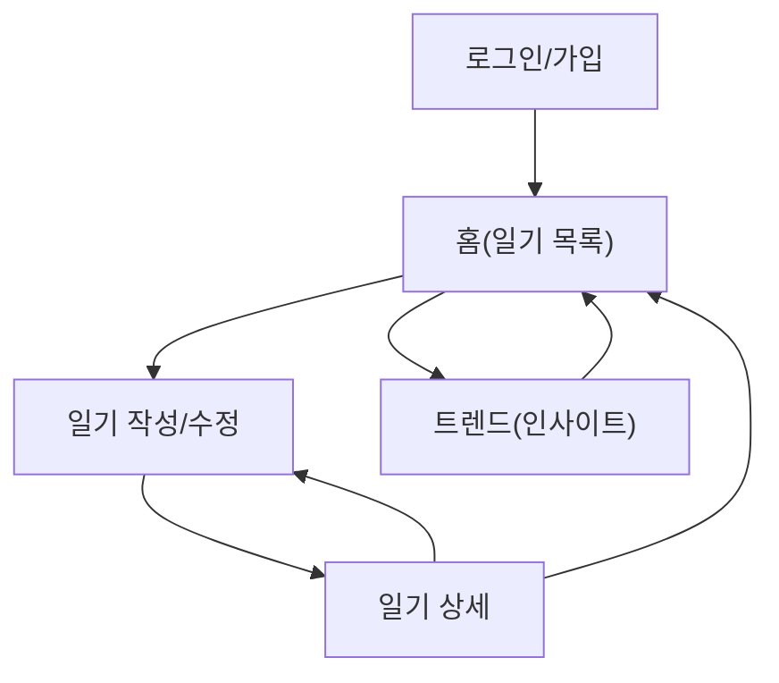

## 1. Product Overview
기분(감정) 선택, 글 작성, 사진/음성 첨부가 가능한 개인 일기 앱이다.
감정 변화·단어 카드·파이차트 기반의 트렌드 화면으로 스스로의 상태를 돌아보게 돕는다.

## 2. Core Features

### 2.1 User Roles
| Role | Registration Method | Core Permissions |
|------|---------------------|------------------|
| 사용자 | 이메일 로그인/가입(매직링크 또는 비밀번호) | 본인 일기 작성/수정/삭제, 첨부 업로드/삭제, 트렌드 확인 |

### 2.2 Feature Module
우리 일기 앱의 핵심 페이지는 다음과 같다:
1. **홈(일기 목록)**: 최근 일기 리스트, 날짜/감정 필터, 새 일기 작성 진입, 트렌드 진입.
2. **일기 작성/수정**: 감정 선택, 본문 작성, 사진/음성 첨부, 저장.
3. **일기 상세**: 내용/첨부 보기, 수정/삭제.
4. **트렌드(인사이트)**: 감정 변화(타임라인), 단어 카드, 감정 분포 파이차트.
5. **로그인/가입**: 이메일 인증 로그인/가입, 로그아웃.

### 2.3 Page Details
| Page Name | Module Name | Feature description |
|-----------|-------------|---------------------|
| 로그인/가입 | 이메일 인증 | 이메일 입력으로 가입/로그인 처리(매직링크 또는 비밀번호). |
| 로그인/가입 | 세션 관리 | 로그인 상태 유지, 로그아웃 제공. |
| 홈(일기 목록) | 상단 내비게이션 | 트렌드/새 일기 버튼 제공, 현재 월/주 표시. |
| 홈(일기 목록) | 목록 보기 | 일기 카드(날짜, 대표 감정, 미리보기)로 목록 표시, 무한 스크롤 또는 페이지네이션. |
| 홈(일기 목록) | 검색/필터 | 날짜 범위와 대표 감정으로 목록 필터링. |
| 일기 작성/수정 | 감정 선택 | 대표 감정 1개 선택(예: 기쁨/슬픔/분노/불안/평온 등) 및 강도(1~5) 입력. |
| 일기 작성/수정 | 본문 작성 | 제목(선택)과 본문 텍스트 입력, 임시저장 없이 저장 시 검증(빈 본문 허용 여부는 설정값으로 고정). |
| 일기 작성/수정 | 첨부(사진/음성) | 사진 파일 첨부/미리보기/삭제, 음성 녹음 시작/정지 후 첨부/삭제. |
| 일기 작성/수정 | 저장/수정 | 작성 내용을 저장하고 홈 또는 상세로 이동, 수정 모드에서 업데이트. |
| 일기 상세 | 콘텐츠 표시 | 날짜/감정/강도/제목/본문 표시, 첨부(갤러리/오디오 플레이어) 재생. |
| 일기 상세 | 편집 액션 | 수정 진입, 삭제(확인 다이얼로그 포함). |
| 트렌드(인사이트) | 감정 변화 | 기간(최근 7/30/90일) 선택 후 감정 강도/대표 감정 변화를 시계열로 표시. |
| 트렌드(인사이트) | 단어 카드 | 선택 기간의 본문에서 상위 키워드를 카드로 표시(빈도/대표 문장 일부). |
| 트렌드(인사이트) | 파이차트 | 선택 기간의 대표 감정 분포를 파이차트로 표시, 항목별 개수/비율 제공. |

## 3. Core Process
- 사용자 플로우
  1) 로그인/가입 후 홈에서 최근 일기 목록을 본다.
  2) 새 일기 작성으로 이동해 대표 감정과 강도, 본문을 입력한다.
  3) 필요 시 사진을 선택해 첨부하고, 음성은 녹음 후 첨부한다.
  4) 저장하면 홈 목록에 반영되고, 일기 상세에서 내용을 확인한다.
  5) 트렌드에서 기간을 선택해 감정 변화, 단어 카드, 감정 분포를 확인한다.
  6) 상세에서 수정/삭제를 수행한다.

