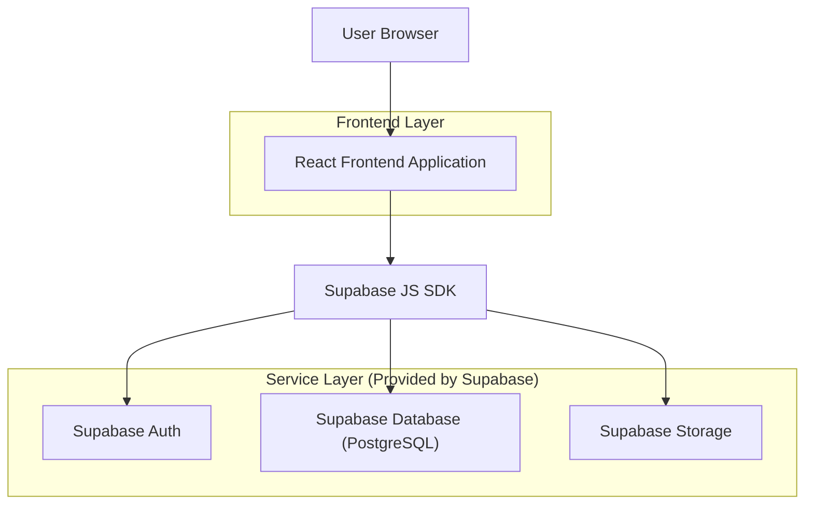
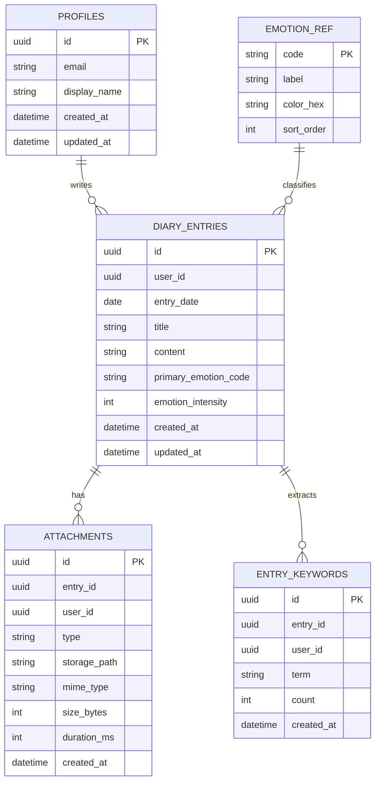

## 1.Architecture design


## 2.Technology Description
- Frontend: React@18 + TypeScript + vite + tailwindcss@3
- Backend: None
- Database/Storage/Auth: Supabase
- Charts: Recharts(또는 동급의 React 차트 라이브러리)
- Media: Web MediaRecorder API(음성 녹음), HTML5 audio/img 렌더링

## 3.Route definitions
| Route | Purpose |
|-------|---------|
| /auth | 로그인/가입(이메일 인증) |
| / | 홈(일기 목록, 필터, 트렌드/작성 진입) |
| /entries/new | 일기 작성 |
| /entries/:id | 일기 상세(수정/삭제 진입) |
| /entries/:id/edit | 일기 수정 |
| /insights | 트렌드(감정 변화/단어 카드/파이차트) |

## 6.Data model(if applicable)

### 6.1 Data model definition


### 6.2 Data Definition Language
Profiles (profiles) — Supabase Auth의 `auth.users.id`와 동일 값으로 논리적 연결
```
CREATE TABLE profiles (
  id UUID PRIMARY KEY,
  email VARCHAR(255) NOT NULL,
  display_name VARCHAR(80),
  created_at TIMESTAMPTZ DEFAULT NOW(),
  updated_at TIMESTAMPTZ DEFAULT NOW()
);

CREATE INDEX idx_profiles_email ON profiles(email);

GRANT SELECT ON profiles TO anon;
GRANT ALL PRIVILEGES ON profiles TO authenticated;
```

Emotion reference (emotion_ref)
```
CREATE TABLE emotion_ref (
  code VARCHAR(30) PRIMARY KEY,
  label VARCHAR(30) NOT NULL,
  color_hex VARCHAR(7) NOT NULL,
  sort_order INTEGER DEFAULT 0
);

GRANT SELECT ON emotion_ref TO anon;
GRANT ALL PRIVILEGES ON emotion_ref TO authenticated;

INSERT INTO emotion_ref(code, label, color_hex, sort_order) VALUES
  ('joy', '기쁨', '#F59E0B', 1),
  ('sadness', '슬픔', '#60A5FA', 2),
  ('anger', '분노', '#EF4444', 3),
  ('anxiety', '불안', '#A78BFA', 4),
  ('calm', '평온', '#34D399', 5);
```

Diary entries (diary_entries)
```
CREATE TABLE diary_entries (
  id UUID PRIMARY KEY DEFAULT gen_random_uuid(),
  user_id UUID NOT NULL,
  entry_date DATE NOT NULL,
  title VARCHAR(120),
  content TEXT NOT NULL,
  primary_emotion_code VARCHAR(30) NOT NULL,
  emotion_intensity INTEGER NOT NULL CHECK (emotion_intensity BETWEEN 1 AND 5),
  created_at TIMESTAMPTZ DEFAULT NOW(),
  updated_at TIMESTAMPTZ DEFAULT NOW()
);

CREATE INDEX idx_diary_entries_user_date ON diary_entries(user_id, entry_date DESC);
CREATE INDEX idx_diary_entries_user_emotion ON diary_entries(user_id, primary_emotion_code);

GRANT SELECT ON diary_entries TO anon;
GRANT ALL PRIVILEGES ON diary_entries TO authenticated;
```

Attachments (attachments)
```
CREATE TABLE attachments (
  id UUID PRIMARY KEY DEFAULT gen_random_uuid(),
  entry_id UUID NOT NULL,
  user_id UUID NOT NULL,
  type VARCHAR(10) NOT NULL CHECK (type IN ('photo','audio')),
  storage_path TEXT NOT NULL,
  mime_type VARCHAR(100),
  size_bytes INTEGER,
  duration_ms INTEGER,
  created_at TIMESTAMPTZ DEFAULT NOW()
);

CREATE INDEX idx_attachments_entry_id ON attachments(entry_id);
CREATE INDEX idx_attachments_user_id ON attachments(user_id);

GRANT SELECT ON attachments TO anon;
GRANT ALL PRIVILEGES ON attachments TO authenticated;
```

Entry keywords (entry_keywords) — 단어 카드를 위한 집계 단위
```
CREATE TABLE entry_keywords (
  id UUID PRIMARY KEY DEFAULT gen_random_uuid(),
  entry_id UUID NOT NULL,
  user_id UUID NOT NULL,
  term VARCHAR(60) NOT NULL,
  count INTEGER NOT NULL DEFAULT 1,
  created_at TIMESTAMPTZ DEFAULT NOW()
);

CREATE INDEX idx_entry_keywords_user_term ON entry_keywords(user_id, term);
CREATE INDEX idx_entry_keywords_entry_id ON entry_keywords(entry_id);

GRANT SELECT ON entry_keywords TO anon;
GRANT ALL PRIVILEGES ON entry_keywords TO authenticated;
```